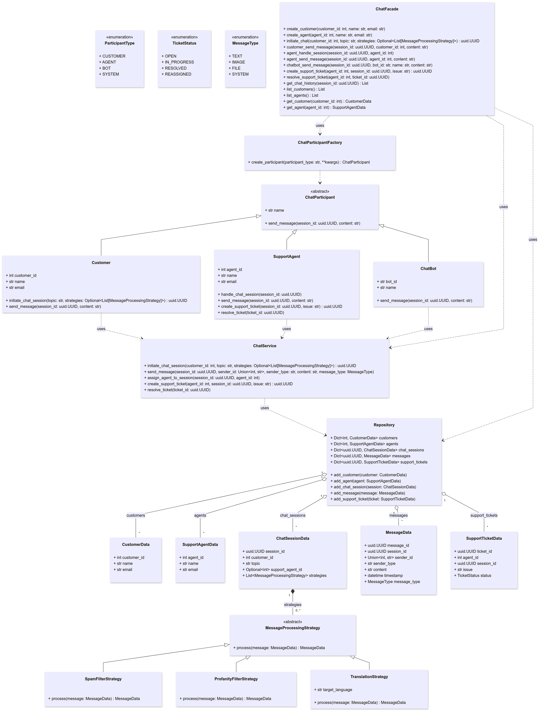

# Chat App
Chat software for customer service.


## Installation

To install the required dependencies, run:
```bash
pip install -r requirements.txt
```

run the tests:
```bash
coverage run -m pytest tests --log-cli-level=INFO
```

## UML Diagrams
### ER Diagrams


### ER Diagrams with Fields


### Class Diagram


### System Design


## Objects / Classes to Create

1. **Actors**:

   - **`ChatParticipant` (abstract base)**:
     Represents a generic participant in the chat, such as a customer, support agent, or bot.
   - **`Customer`**:
     Represents a customer who initiates and participates in chat sessions, providing methods to start chats and send messages.
   - **`SupportAgent`**:
     Represents a support agent who manages customer queries, handles chat sessions, creates support tickets, and resolves issues.
   - **`ChatBot`**:
     Represents an automated participant that can send predefined or system messages and interact with customers based on programmed logic.

2. **Core Data Models**:

   - **`CustomerData`**:
     Stores customer-related information, including ID, name, and email, to identify and manage customer interactions.
   - **`SupportAgentData`**:
     Stores support agent details like ID, name, and email, used for assigning agents to sessions and managing agent-specific data.
   - **`ChatSessionData`**:
     Tracks an individual chat session's details, including session ID, customer ID, optional support agent ID, topic, and associated message processing strategies.
   - **`MessageData`**:
     Represents a message sent in a chat, including the message content, sender details, type (text, image, file), and timestamp.
   - **`SupportTicketData`**:
     Tracks support tickets, linking them to a session and agent, with fields for issue description and status (open, in_progress, resolved).

3. **Services and Repositories**:

   - **`Repository`**:
     Manages the persistent storage of all data models, including customers, agents, chat sessions, messages, and support tickets. Provides methods to add, retrieve, and update data.
   - **`ChatService`**:
     Handles the business logic for chat-related operations, such as initiating sessions, processing messages, assigning agents, and managing tickets.

4. **Strategies for Message Processing**:

   - **`MessageProcessingStrategy` (abstract base)**:
     Defines a standard interface for message processing strategies, allowing flexible filtering or transformation of messages.
   - **`SpamFilterStrategy`**:
     Filters out spam messages using predefined rules or algorithms.
   - **`ProfanityFilterStrategy`**:
     Detects and censors inappropriate language in messages.
   - **`TranslationStrategy`**:
     Translates messages into a specified target language for multilingual communication.

---

## Used Design Patterns

### 1. **Repository Pattern**

- **Class**: `Repository`
- **Purpose**:
  - Acts as a centralized layer for managing access to and manipulation of data models, ensuring separation of concerns between business logic and data access.
- **Usage**:
  - Simplifies data management by providing a consistent API for CRUD operations on all core models.

### 2. **Facade Pattern**

- **Class**: `ChatFacade`
- **Purpose**:
  - Provides a unified and simplified interface to the underlying system, allowing interaction with `ChatService`, `Repository`, and `ChatParticipantFactory` without exposing the complexities.
- **Usage**:
  - Simplifies frontend interactions with the system by wrapping the low-level components.

### 3. **Factory Pattern**

- **Class**: `ChatParticipantFactory`
- **Purpose**:
  - Creates instances of different types of `ChatParticipant` (e.g., `Customer`, `SupportAgent`, `ChatBot`) based on input parameters.
- **Usage**:
  - Encapsulates the object creation logic, making it easier to extend and modify the types of chat participants.

### 4. **Strategy Pattern**

- **Classes**:
  - `MessageProcessingStrategy` (abstract base class)
  - `SpamFilterStrategy`
  - `ProfanityFilterStrategy`
  - `TranslationStrategy`
- **Purpose**:
  - Defines a family of algorithms (message processing strategies), encapsulates them, and makes them interchangeable.
- **Usage**:
  - Allows flexible addition or modification of message processing logic without altering the system's core structure.

---

## How They Interact ?

- **Customer Interaction**:

  - A `Customer` initiates a chat session via the `ChatService`, which creates a new `ChatSessionData` object in the `Repository`.
  - The customer sends messages, which are processed by any assigned `MessageProcessingStrategy`.

- **Agent Interaction**:

  - A `SupportAgent` is assigned to a chat session via the `ChatService`.
  - They can send and receive messages, create support tickets for unresolved issues, and mark tickets as resolved.

- **ChatBot Interaction**:

  - A `ChatBot` participates as an automated agent, processing or sending predefined/system messages.

- **Message Processing**:

  - When a message is sent, the `ChatService` invokes the strategies defined in the `ChatSessionData` to filter spam, check profanity, or translate messages.

- **Repository Management**:

  - All data related to customers, agents, chat sessions, messages, and support tickets is stored and retrieved through the `Repository`.

- **Facade Usage**:
  - The `ChatFacade` simplifies complex interactions by wrapping around `ChatService`, `Repository`, and `ChatParticipantFactory`.

This approach ensures a robust, scalable, and user-friendly chat application while enabling future enhancements.

---

## Frontend Interaction with the Chat System

The frontend communicates with the chat system primarily through a REST API interface exposed by the ChatFacade. This API acts as the gateway for managing chat sessions, sending messages, and accessing related data.

The Interaction with the frontend occurs via two forms of communication protocols:

- **Real-Time Updates**: WebSockets are used to receive real-time updates, such as new messages or status changes.

- **Metadata & Authentication**: HTTP/REST requests handle fetching chat metadata, user authentication, and other state management tasks.

### Frontend Interaction with Classes

1. **Chat Initiation**:

   - The frontend interacts with the `ChatFacade` to initiate a chat session (`initiate_chat`), passing customer details, the topic, and optional strategies.

2. **Sending Messages**:

   - The frontend calls methods like `customer_send_message` or `agent_send_message` on the `ChatFacade`, which delegates the action to the appropriate participant via `ChatService`.

3. **Fetching Chat History**:

   - The frontend retrieves the session’s message history by invoking `get_chat_history` on the `ChatFacade`.

4. **Support Ticket Management**:
   - Support agents can interact with tickets (e.g., create or resolve) via `ChatFacade`.

---

## Enhancements for Chat Software Solutions

1. **Feedback Feature**:  
   Allow users to provide ratings and feedback for chat sessions to improve service quality and agent performance.


2. **Notification Service**:  
   Centralized service to handle the creation, delivery, and tracking of real-time, email, and push notifications across platforms.

