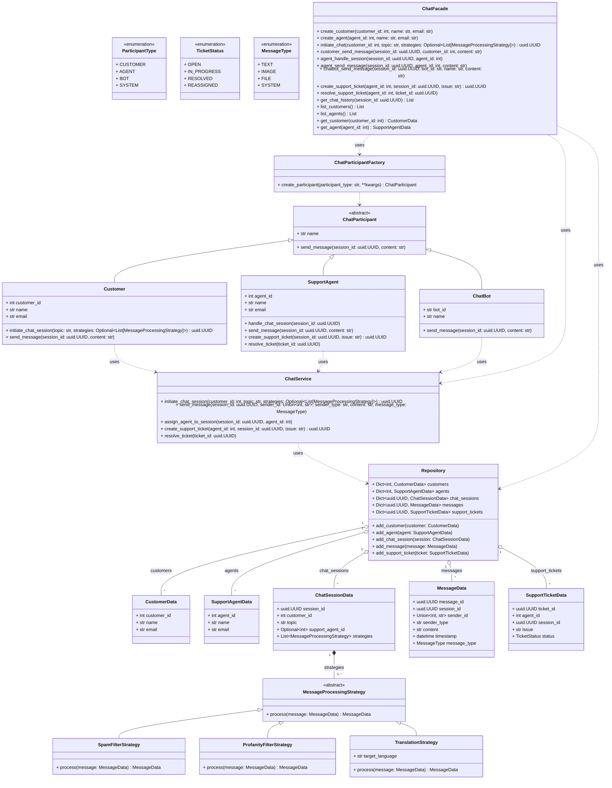

```mermaid

classDiagram

%% Enums
class ParticipantType {
<<enumeration>>
+ CUSTOMER
+ AGENT
+ BOT
+ SYSTEM
}
class TicketStatus {
<<enumeration>>
+ OPEN
+ IN_PROGRESS
+ RESOLVED
+ REASSIGNED
}

class MessageType {
<<enumeration>>
+ TEXT
+ IMAGE
+ FILE
+ SYSTEM
}

%% Data Models
class CustomerData {
+ int customer_id
+ str name
+ str email
}

class SupportAgentData {
+ int agent_id
+ str name
+ str email
}

class ChatSessionData {
+ uuid.UUID session_id
+ int customer_id
+ str topic
+ Optional~int~ support_agent_id
+ List~MessageProcessingStrategy~ strategies
}

class MessageData {
+ uuid.UUID message_id
+ uuid.UUID session_id
+ Union~int, str~ sender_id
+ str sender_type
+ str content
+ datetime timestamp
+ MessageType message_type
}

class SupportTicketData {
+ uuid.UUID ticket_id
+ int agent_id
+ uuid.UUID session_id
+ str issue
+ TicketStatus status
}

%% Repository
class Repository {
+ Dict~int, CustomerData~ customers
+ Dict~int, SupportAgentData~ agents
+ Dict~uuid.UUID, ChatSessionData~ chat_sessions
+ Dict~uuid.UUID, MessageData~ messages
+ Dict~uuid.UUID, SupportTicketData~ support_tickets
+ add_customer(customer: CustomerData)
+ add_agent(agent: SupportAgentData)
+ add_chat_session(session: ChatSessionData)
+ add_message(message: MessageData)
+ add_support_ticket(ticket: SupportTicketData)
}

Repository "1" o-- "*" CustomerData : customers
Repository "1" o-- "*" SupportAgentData : agents
Repository "1" o-- "*" ChatSessionData : chat_sessions
Repository "1" o-- "*" MessageData : messages
Repository "1" o-- "*" SupportTicketData : support_tickets

%% Strategy Pattern
class MessageProcessingStrategy {
<<abstract>>
+ process(message: MessageData) MessageData
}

class SpamFilterStrategy {
+ process(message: MessageData) MessageData
}

class ProfanityFilterStrategy {
+ process(message: MessageData) MessageData
}

class TranslationStrategy {
+ str target_language
+ process(message: MessageData) MessageData
}

MessageProcessingStrategy <|-- SpamFilterStrategy
MessageProcessingStrategy <|-- ProfanityFilterStrategy
MessageProcessingStrategy <|-- TranslationStrategy

ChatSessionData "1" *-- "0..*" MessageProcessingStrategy : strategies

%% Service Layer
class ChatService {
+ initiate_chat_session(customer_id: int, topic: str, strategies: Optional~List[MessageProcessingStrategy]~) uuid.UUID
+ send_message(session_id: uuid.UUID, sender_id: Union~int, str~, sender_type: str, content: str, message_type: MessageType)
+ assign_agent_to_session(session_id: uuid.UUID, agent_id: int)
+ create_support_ticket(agent_id: int, session_id: uuid.UUID, issue: str) uuid.UUID
+ resolve_ticket(ticket_id: uuid.UUID)
}

ChatService ..> Repository : uses

%% Factory Pattern
class ChatParticipantFactory {
+ create_participant(participant_type: str, **kwargs) ChatParticipant
}

ChatParticipantFactory ..> ChatParticipant

%% Chat Participants
class ChatParticipant {
<<abstract>>
+ str name
+ send_message(session_id: uuid.UUID, content: str)
}

class Customer {
+ int customer_id
+ str name
+ str email
+ initiate_chat_session(topic: str, strategies: Optional~List[MessageProcessingStrategy]~) uuid.UUID
+ send_message(session_id: uuid.UUID, content: str)
}

class SupportAgent {
+ int agent_id
+ str name
+ str email
+ handle_chat_session(session_id: uuid.UUID)
+ send_message(session_id: uuid.UUID, content: str)
+ create_support_ticket(session_id: uuid.UUID, issue: str) uuid.UUID
+ resolve_ticket(ticket_id: uuid.UUID)
}

class ChatBot {
+ str bot_id
+ str name
+ send_message(session_id: uuid.UUID, content: str)
}

ChatParticipant <|-- Customer
ChatParticipant <|-- SupportAgent
ChatParticipant <|-- ChatBot

Customer ..> ChatService : uses
SupportAgent ..> ChatService : uses
ChatBot ..> ChatService : uses

%% Facade
class ChatFacade {
+ create_customer(customer_id: int, name: str, email: str)
+ create_agent(agent_id: int, name: str, email: str)
+ initiate_chat(customer_id: int, topic: str, strategies: Optional~List[MessageProcessingStrategy]~) uuid.UUID
+ customer_send_message(session_id: uuid.UUID, customer_id: int, content: str)
+ agent_handle_session(session_id: uuid.UUID, agent_id: int)
+ agent_send_message(session_id: uuid.UUID, agent_id: int, content: str)
+ chatbot_send_message(session_id: uuid.UUID, bot_id: str, name: str, content: str)
+ create_support_ticket(agent_id: int, session_id: uuid.UUID, issue: str) uuid.UUID
+ resolve_support_ticket(agent_id: int, ticket_id: uuid.UUID)
+ get_chat_history(session_id: uuid.UUID) List
+ list_customers() List
+ list_agents() List
+ get_customer(customer_id: int) CustomerData
+ get_agent(agent_id: int) SupportAgentData
}

ChatFacade ..> ChatParticipantFactory : uses
ChatFacade ..> ChatService : uses
ChatFacade ..> Repository : uses

```
