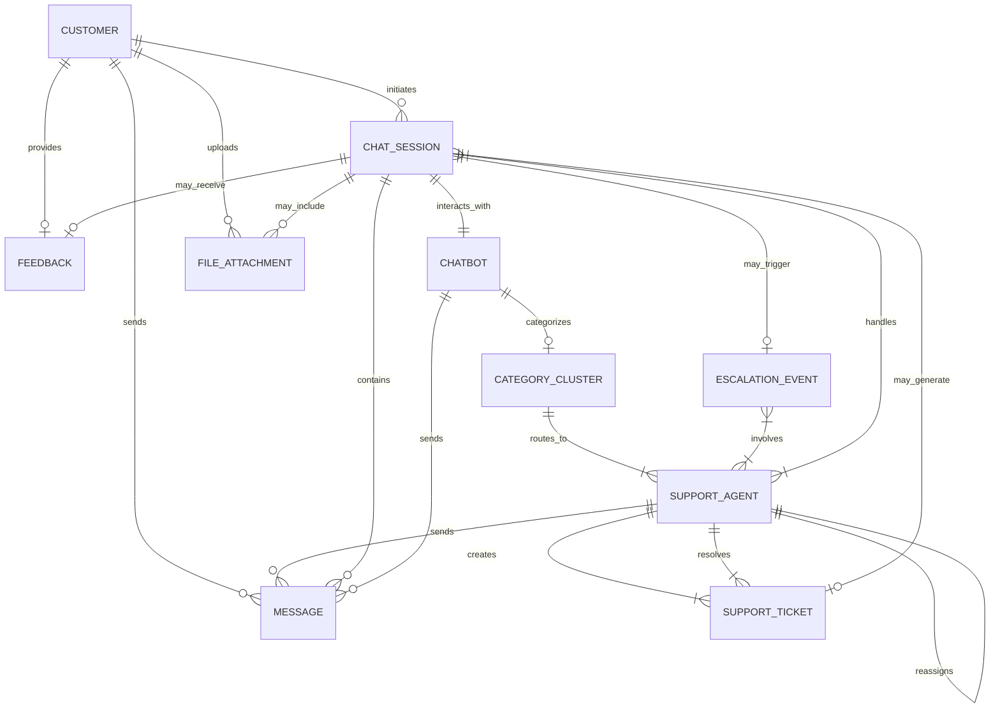

```mermaid
erDiagram
  CUSTOMER
  SUPPORT_AGENT
  CHAT_SESSION
  MESSAGE
  FEEDBACK
  SUPPORT_TICKET
  CHATBOT
  FILE_ATTACHMENT
  CATEGORY_CLUSTER
  ESCALATION_EVENT

  CUSTOMER ||--o{ CHAT_SESSION : initiates
  CUSTOMER ||--o{ FILE_ATTACHMENT: uploads
  CUSTOMER ||--o| FEEDBACK: provides
  CUSTOMER ||--o{ MESSAGE: sends

  SUPPORT_AGENT ||--|{ SUPPORT_TICKET: creates
  SUPPORT_AGENT ||--|{ SUPPORT_TICKET: resolves
  SUPPORT_AGENT }|--|{ CHAT_SESSION: handles
  SUPPORT_AGENT ||--o{ MESSAGE: sends
  SUPPORT_AGENT ||--|| SUPPORT_AGENT: reassigns

  CHAT_SESSION ||--o{ MESSAGE: contains
  CHAT_SESSION ||--o| FEEDBACK: may_receive
  CHAT_SESSION ||--o| SUPPORT_TICKET: may_generate
  CHAT_SESSION ||--o{ FILE_ATTACHMENT: may_include
  CHAT_SESSION ||--|| CHATBOT: interacts_with
  CHAT_SESSION ||--o| ESCALATION_EVENT: may_trigger

  CHATBOT ||--o{ MESSAGE: sends
  CHATBOT ||--o| CATEGORY_CLUSTER: categorizes

  CATEGORY_CLUSTER ||--|{ SUPPORT_AGENT: routes_to


  ESCALATION_EVENT }|--|{ SUPPORT_AGENT: involves

```
