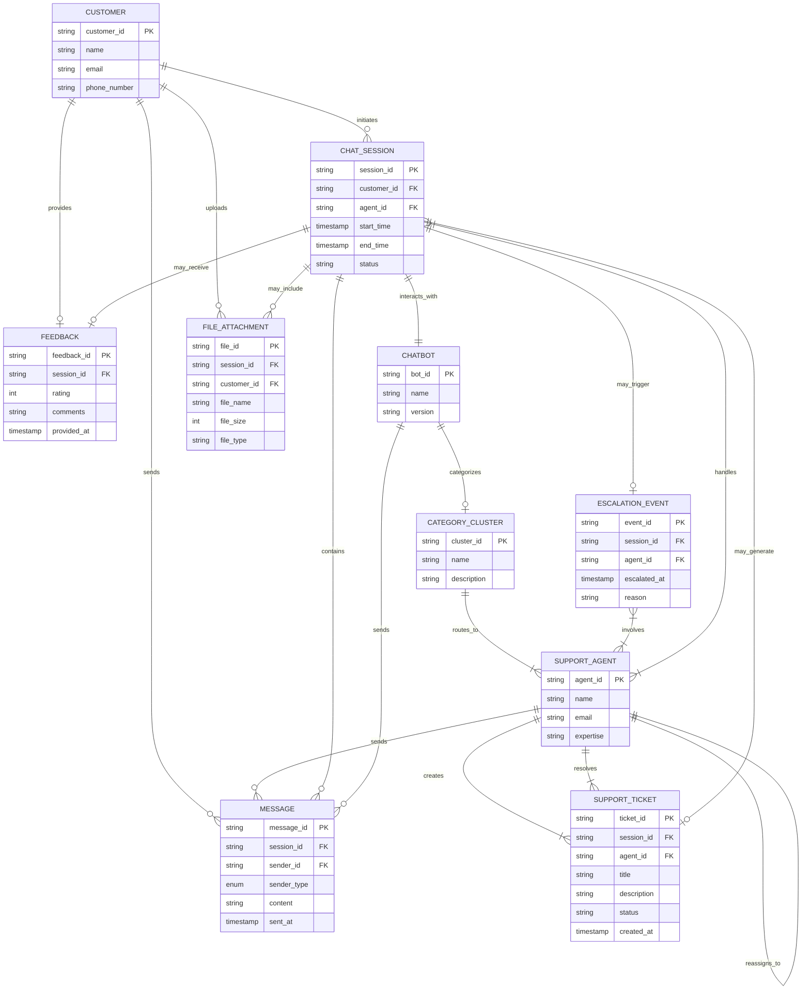

```mermaid

erDiagram
  CUSTOMER {
    string customer_id PK
    string name
    string email
    string phone_number
  }
  SUPPORT_AGENT {
    string agent_id PK
    string name
    string email
    string expertise
  }
  CHAT_SESSION {
    string session_id PK
    string customer_id FK
    string agent_id FK
    timestamp start_time
    timestamp end_time
    string status
  }
  MESSAGE {
    string message_id PK
    string session_id FK
    string sender_id FK
    enum sender_type
    string content
    timestamp sent_at
  }
  FEEDBACK {
    string feedback_id PK
    string session_id FK
    int rating
    string comments
    timestamp provided_at
  }
  SUPPORT_TICKET {
    string ticket_id PK
    string session_id FK
    string agent_id FK
    string title
    string description
    string status
    timestamp created_at
  }
  CHATBOT {
    string bot_id PK
    string name
    string version
  }
  FILE_ATTACHMENT {
    string file_id PK
    string session_id FK
    string customer_id FK
    string file_name
    int file_size
    string file_type
  }
  CATEGORY_CLUSTER {
    string cluster_id PK
    string name
    string description
  }
  ESCALATION_EVENT {
    string event_id PK
    string session_id FK
    string agent_id FK
    timestamp escalated_at
    string reason
  }

  CUSTOMER ||--o{ CHAT_SESSION : "initiates"
  CUSTOMER ||--o{ FILE_ATTACHMENT: "uploads"
  CUSTOMER ||--o| FEEDBACK: "provides"
  CUSTOMER ||--o{ MESSAGE: "sends"

  SUPPORT_AGENT ||--|{ SUPPORT_TICKET: "creates"
  SUPPORT_AGENT ||--|{ SUPPORT_TICKET: "resolves"
  SUPPORT_AGENT }|--|{ CHAT_SESSION: "handles"
  SUPPORT_AGENT ||--o{ MESSAGE: "sends"
  SUPPORT_AGENT ||--|| SUPPORT_AGENT: "reassigns_to"

  CHAT_SESSION ||--o{ MESSAGE: "contains"
  CHAT_SESSION ||--o| FEEDBACK: "may_receive"
  CHAT_SESSION ||--o| SUPPORT_TICKET: "may_generate"
  CHAT_SESSION ||--o{ FILE_ATTACHMENT: "may_include"
  CHAT_SESSION ||--|| CHATBOT: "interacts_with"
  CHAT_SESSION ||--o| ESCALATION_EVENT: "may_trigger"

  CHATBOT ||--o{ MESSAGE: "sends"
  CHATBOT ||--o| CATEGORY_CLUSTER: "categorizes"

  CATEGORY_CLUSTER ||--|{ SUPPORT_AGENT: "routes_to"

  ESCALATION_EVENT }|--|{ SUPPORT_AGENT: "involves"


```
