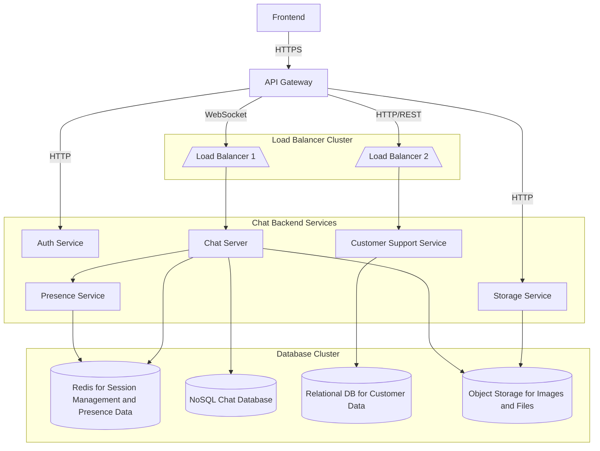

```mermaid

flowchart TD
    Frontend -->|HTTPS| APIGateway[API Gateway]
    subgraph LBCluster [Load Balancer Cluster]
        LB1[/Load Balancer 1\]
        LB2[/Load Balancer 2\]
    end
    subgraph ChatServices [Chat Backend Services]
        Auth[Auth Service]
        ChatServer[Chat Server]
        CSService[Customer Support Service]
        StorageService[Storage Service]
        PresenceService[Presence Service]
    end
    subgraph Databases [Database Cluster]
        Redis[(Redis for Session Management and Presence Data)]
        NoSQL[(NoSQL Chat Database)]
        SQL[(Relational DB for Customer Data)]
        ObjectStorage[(Object Storage for Images and Files)]
    end

    APIGateway -->|WebSocket| LB1 --> ChatServer
    APIGateway -->|HTTP/REST| LB2 --> CSService
    APIGateway -->|HTTP| Auth
    APIGateway -->|HTTP| StorageService
    ChatServer --> Redis
    ChatServer --> NoSQL
    ChatServer --> PresenceService
    CSService --> SQL
    StorageService --> ObjectStorage
    ChatServer --> ObjectStorage
    PresenceService --> Redis


```
